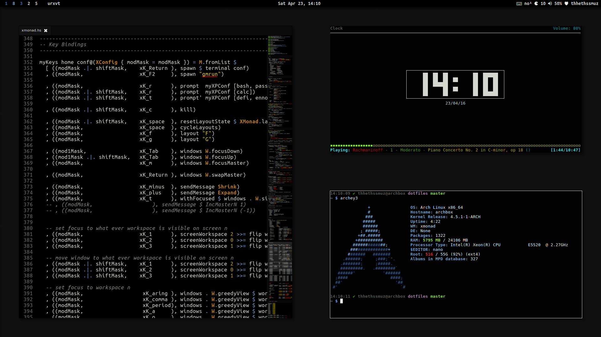

# dotfiles

## Highlights

- [xmonad](http://xmonad.org/) with a series of [dzen](http://robm.github.io/dzen/) status bars and menus
- `git` aware prompt
- optimized for the Dvorak keyboard layout



## Cloning

The simplest procedure for cloning into home, is to make an empty git repo in home and make it track master:

```sh
cd
git init
git remote add origin git@github.com:Thhethssmuz/dotfiles.git
git pull origin master
```

From this point on you should be able to proceed as normal.

## XMonad

Build status-bar icons:

```sh
.xmonad/scripts/mkicons.sh
```
